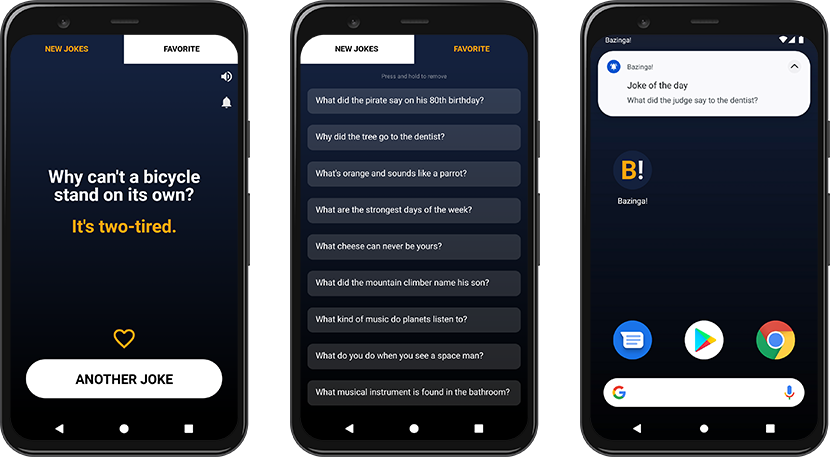

# Bazinga! App

**Bazinga!** is an Android app developed in **React Native**. The main task of the app is to tell jokes.

App has been published on Google Play and is available [here](https://play.google.com/store/apps/details?id=com.bazinga.jokes) with more details.

> The motivation for creating this project was learning new technologies :mortar_board:

---

## Features
- Hundreds of jokes with a punchline
- Library of favorites jokes
- Daily notifications
- Ba-Dum-Tss sound

## Technologies
- [React Native](https://github.com/facebook/react-native) 0.64.0
- [React Navigation](https://github.com/react-navigation/react-navigation) 5.9.6
- [React Native Async Storage](https://github.com/react-native-async-storage/async-storage) 1.15.6
- [React Native Push Notifications](https://github.com/zo0r/react-native-push-notification) 8.1.1

## Requirements
- Android version 5 (*Lollipop*) or higher
- Node.js and npm

## Setup
1. `npm install` Install Node dependencies
2. `npx react-native run-android` Run the build and launch the app on an Android device or emulator
